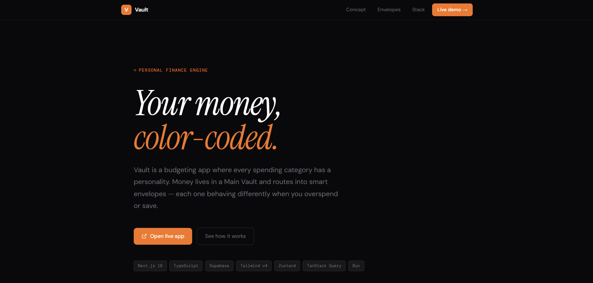

# Vault — Color-Coded Personal Finance Engine

> Most budget apps treat every category the same. Vault doesn't. Each envelope color defines a distinct financial behavior — how it handles savings, overspending, and month-end rollover.

&nbsp;

&nbsp;

## The idea

Standard budgeting tools give you categories and a limit. Vault gives each category a **color** that defines its entire financial personality:

| Color     | Type          | Behavior                                                                                                              |
| --------- | ------------- | --------------------------------------------------------------------------------------------------------------------- |
| 🟠 Orange | Unexpected    | No budget set. Reacts to spending by pulling from Main Vault.                                                         |
| 🟡 Yellow | Fluid         | Overspend → Main Vault covers it. Underspend → sweeps back automatically.                                             |
| 🔴 Red    | Pocket Money  | Underspend stays yours forever. Overspend pulls from Main Vault.                                                      |
| 🟢 Green  | Pocket Money  | Same as Red — a second color for tracking separate discretionary intents.                                             |
| 🔵 Blue   | Isolated Goal | Fully self-contained. Surplus builds a private Blue Vault. Hard-blocked if it runs dry — Main Vault is never touched. |

Two vaults run in parallel: the **Main Vault** (your safety net, always visible) and the **Blue Vault** (a private accumulation pool fed only by Blue envelope surpluses). They never interact.

&nbsp;

## Tech stack

|               |                                      |
| ------------- | ------------------------------------ |
| Framework     | Next.js 16 (App Router)              |
| Language      | TypeScript                           |
| Styling       | Tailwind CSS v4                      |
| Components    | Radix UI, Lucide React, Tabler Icons |
| State         | Zustand                              |
| Server state  | TanStack Query                       |
| Backend / DB  | Supabase (PostgreSQL)                |
| Auth          | Supabase Auth                        |
| Notifications | Sonner                               |
| Runtime       | Bun                                  |
| Deployment    | Vercel                               |

&nbsp;

## Live

**App → [https://money-puce-ten.vercel.app/](https://money-puce-ten.vercel.app/)**  
**Docs → [https://funny-florentine-523c81.netlify.app/](https://funny-florentine-523c81.netlify.app/)**

---

MIT License
